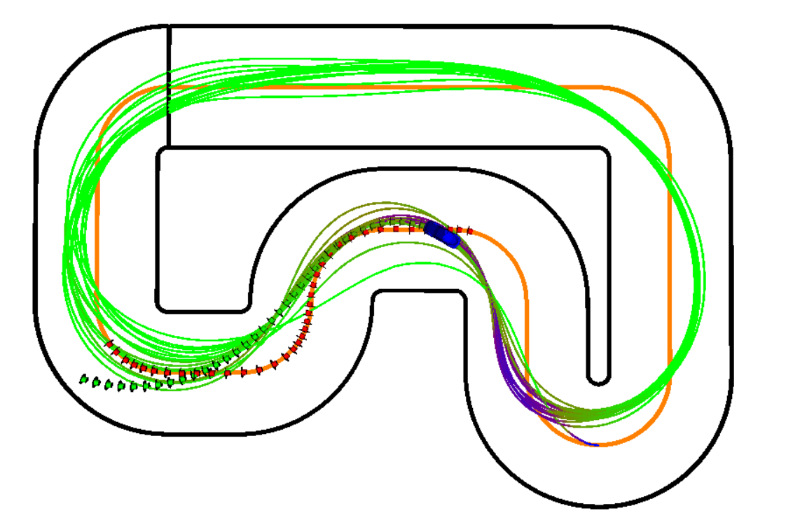

# A Modified MPCC Controller with Splines for Autonomous Racing Application

This repository implements a **Modified Model Predictive Contouring Control (MPCC)** framework with spline-based track modeling for autonomous racing applications. The project demonstrates advanced control strategies and spline generation techniques, tailored for high-speed autonomous vehicles.

---

### Full Track Spline


This is the visualization of the full track spline that represents the complete racing path for autonomous vehicle navigation.

### Trajectory Plot


The trajectory plot demonstrates the path taken by the vehicle during the real vehicle run.


## Directory Structure
```plaintext
Python_Spline_Generation/
├── .idea/                           # IDE-specific configuration files
├── FREIBURG_FULL_TRACK.yaml         # YAML representation of the Freiburg full track
├── custom_length_track_spline.png   # Visualization of a custom-length track spline
├── fulltrack_spline.png             # Visualization of the full track spline
├── fulltrack_spline.yaml            # YAML file for the full track spline
├── track_splines.py                 # Script for spline generation
├── src/
    ├── crs/
        ├── controls/
            ├── common/              # Common control logic
            ├── mpc_controller/      # Core MPCC implementation
            ├── mpc_solvers/         # Solvers for MPC optimization
```
## Features

- **Spline-based Track Representation**  
  Smooth spline curves are used to model race tracks, ensuring efficient and precise navigation for autonomous vehicles.

- **Modified MPCC Algorithm**  
  An enhanced Model Predictive Contouring Control (MPCC) framework is implemented for better trajectory tracking and time-optimized racing.

- **Visualization Tools**  
  Scripts are provided to generate and visualize spline-based tracks, aiding in analysis and debugging.

- **Flexible and Modular Design**  
  The codebase is structured in a modular way, allowing easy customization and expansion for future research and development.

- **Track Data Representation**  
  YAML files are used to store track information, enabling reusable and scalable input data handling.

- **Simulation and Analysis Outputs**  
  Provides detailed logs, trajectory visualizations, and performance metrics for simulation analysis.

### Dependencies
- **Python**: Version 3.8 or higher
- **Required Python Libraries**: 
  - `numpy`
  - `matplotlib`
  - `scipy`
  - `pyyaml`
- [CasADi](https://web.casadi.org/) (A symbolic framework for nonlinear optimization and algorithmic differentiation.)
- [Acados](https://docs.acados.org/): A fast and embedded solvers for nonlinear optimal control.


## Project Report and Presentation

This repository includes:

- **[Project Report](docs/report.pdf)**: A detailed explanation of the methodology, implementation, and results for the project, titled *A Modified MPCC Controller with Splines for Autonomous Racing Application*.
- **[Presentation Slides](docs/presentation.pdf)**: A concise overview of the project, highlighting key techniques, results, and conclusions.

---

## Contributors

- **Ankita Pawar** 
- **Shikha Tiwari** 

---

## Acknowledgments

- **Freiburg Racing Dataset**: Provided essential track data for spline generation and evaluation.
- **Open-source Libraries**: Libraries like 'numpy', 'matplotlib', and 'scipy' supported the development of this project.

---

## References
[1] Liniger, A., Domahidi, A., and Morari, M. , “Optimization-based autonomous racing of 1: 43 scale RC cars. ” Optimal Control Applications and Methods, vol. 36(5), pp. 628–647, July 2015.\
[2] D. Lam, C. Manzie, and M. Good, “Model predictive contouring control,” in Proceedings of the IEEE Conference on Decision andControl. Institute of Electrical and Electronics Engineers Inc., 2010, pp. 6137–6142.\
[3] E. Bakker, L. Nyborg, and H. Pacejka, “Tyre modelling for use in vehicle dynamics studies,” SAE, 1987.\
[4] Joel A E Andersson and Joris Gillis and Greg Horn and James B Rawlings and Moritz Diehl, ”CasADi - A software framework for nonlinear optimization and optimal control”, Mathematical Programming Computation, vol. 11, no. 1, pp. 1–36, 2019, doi:10.1007/s12532-018-0139-4.\
[5] Verschueren, R., Frison, G., Kouzoupis, D., Frey, J., van Duijkeren, N., Zanelli, A., Novoselnik, B., Albin, T., Quirynen, R., & Diehl, M. (2021). **acados -- a modular open-source framework for fast embedded optimal control**. *Mathematical Programming Computation*.


## Code Sharing Notice

Since this project involves internal code developed as part of university research, **not all code could be shared publicly**. This repository contains only the portions of the code that were implemented and can be shared externally by our team. Some proprietary components remain internal to the university and are not included here.
